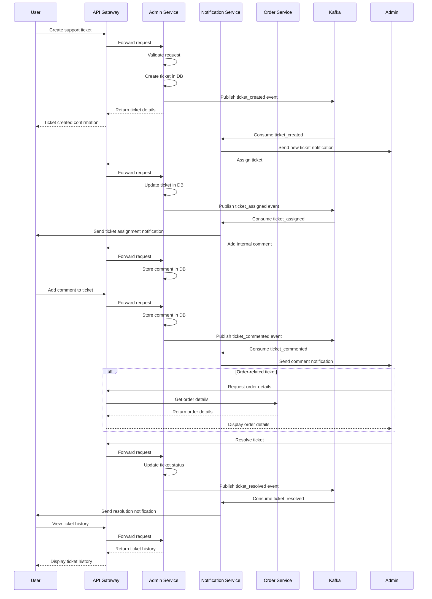

# Support Ticket Management Flow

This document details the support ticket management flow in the Nibble platform, explaining how customer support requests are handled from creation to resolution.

## Overview

The support ticket system provides a structured way for users to report issues, ask questions, and receive help from customer support staff. The flow encompasses ticket creation, assignment, communication, and resolution, with the Admin Service being the primary owner of this functionality.

## Flow Diagram



## Step-by-Step Process

### 1. Ticket Creation Phase

1. **Submit Ticket**:
   - User submits a support ticket via the API Gateway
   - User provides subject, description, and optional order reference
   - User can specify priority (defaults to "medium")
   - Admin Service validates the request
   - Admin Service creates a ticket record with status "open"
   - Admin Service publishes a `ticket_created` event to Kafka

2. **Initial Notification**:
   - Notification Service consumes the `ticket_created` event
   - Admin dashboard is updated with the new ticket
   - Support staff are alerted to the new ticket

### 2. Ticket Triage and Assignment Phase

1. **Ticket Review**:
   - Admin staff review new tickets in the support dashboard
   - Tickets are sorted by priority and creation time
   - Admins can view ticket details and related information

2. **Ticket Assignment**:
   - Admin assigns the ticket to a specific support agent
   - Admin Service updates the ticket with the assigned agent
   - Admin Service changes status to "in_progress"
   - Admin Service publishes a `ticket_assigned` event
   - Notification Service informs the user their ticket is being worked on

### 3. Investigation and Communication Phase

1. **Internal Notes**:
   - Support agents can add internal notes visible only to other admins
   - Notes are stored with the ticket but flagged as internal
   - These notes don't trigger user notifications

2. **Order Information Retrieval** (if applicable):
   - If ticket references an order, support agent can view order details
   - Admin Service communicates with Order Service to fetch information
   - Order history, payment details, and delivery information are displayed

3. **User Communication**:
   - Support agent adds comments to the ticket
   - User receives notification of new comments
   - User can respond with additional comments
   - All communications are timestamped and stored with the ticket

4. **Status Updates**:
   - Support agent can update ticket status as investigation progresses
   - Each status change generates an event and notification

### 4. Resolution Phase

1. **Ticket Resolution**:
   - Support agent resolves the issue and documents the solution
   - Admin Service updates ticket status to "resolved"
   - Admin Service publishes a `ticket_resolved` event
   - Notification Service informs the user their ticket is resolved

2. **Feedback Collection** (optional):
   - User can be prompted to rate their support experience
   - Feedback is stored with the ticket for quality analysis

3. **Ticket Closure**:
   - After a configurable period with no further comments, ticket is auto-closed
   - Or user can explicitly close the ticket
   - Admin Service updates status to "closed"
   - Admin Service publishes a `ticket_closed` event

### 5. Reporting Phase

1. **Metrics Collection**:
   - Analytics Service processes ticket data
   - Key metrics such as response time, resolution time, and satisfaction are calculated
   - Data is made available for admin dashboards

## Services Involved

| Service | Responsibility in Support Ticket Flow |
|---------|--------------------------------------|
| **API Gateway** | Routes ticket-related requests to Admin Service |
| **Admin Service** | Core service for ticket management, storage, and processing |
| **Notification Service** | Sends notifications to users and admins |
| **Order Service** | Provides order details for order-related tickets |
| **User Service** | Provides user information for context |
| **Analytics Service** | Processes ticket data for reporting |

## API Endpoints

### Admin Service
- `POST /api/v1/tickets` - Create a new ticket
- `GET /api/v1/tickets` - List tickets (for admins)
- `GET /api/v1/tickets/my` - List user's own tickets
- `GET /api/v1/tickets/assigned` - List tickets assigned to admin
- `GET /api/v1/tickets/{ticket_id}` - Get ticket details
- `PUT /api/v1/tickets/{ticket_id}/status` - Update ticket status
- `PUT /api/v1/tickets/{ticket_id}/assign` - Assign ticket to admin
- `POST /api/v1/tickets/{ticket_id}/comments` - Add comment to ticket
- `GET /api/v1/tickets/{ticket_id}/comments` - Get ticket comments

## Kafka Events

| Event Type | Producer | Consumers | Purpose |
|------------|----------|-----------|---------|
| `ticket_created` | Admin Service | Notification Service, Analytics Service | Signal new ticket creation |
| `ticket_assigned` | Admin Service | Notification Service | Signal ticket assignment to agent |
| `ticket_status_changed` | Admin Service | Notification Service | Signal ticket status update |
| `ticket_commented` | Admin Service | Notification Service | Signal new comment added |
| `ticket_resolved` | Admin Service | Notification Service, Analytics Service | Signal ticket resolution |
| `ticket_closed` | Admin Service | Analytics Service | Signal ticket closure |

## Database Interactions

### Admin Service Database
- `admin_service.support_tickets` table stores core ticket information
- `admin_service.ticket_comments` table stores communication thread
- Both tables have appropriate indexes for efficient querying

## Data Model

### Support Ticket
```json
{
  "id": "UUID",
  "user_id": "UUID",
  "order_id": "UUID (optional)",
  "subject": "string",
  "description": "string",
  "status": "enum(open, in_progress, resolved, closed)",
  "priority": "enum(low, medium, high, urgent)",
  "assigned_to": "UUID (optional)",
  "resolved_at": "timestamp (optional)",
  "resolution_notes": "string (optional)",
  "created_at": "timestamp",
  "updated_at": "timestamp"
}
```

### Ticket Comment
```json
{
  "id": "UUID",
  "ticket_id": "UUID",
  "user_id": "UUID",
  "comment": "string",
  "is_internal": "boolean",
  "created_at": "timestamp"
}
```

## Role-Based Access Control

The ticket system implements the following permissions:

1. **Users (Customers, Restaurants, Drivers)**:
   - Can create tickets
   - Can view their own tickets
   - Can add comments to their tickets
   - Cannot see internal comments
   - Cannot change ticket status or assignment

2. **Support Agents**:
   - Can view all tickets
   - Can update ticket status
   - Can add internal and public comments
   - Can view all ticket details
   - Can assign tickets to themselves

3. **Support Supervisors**:
   - All Support Agent permissions
   - Can assign tickets to other agents
   - Can view support metrics and reports
   - Can configure ticket priorities and categories

## Failure Scenarios and Recovery

### 1. Comment Submission Failure
- **Scenario**: User comment fails to save due to database or service issue
- **Handling**:
  - Frontend implements retry mechanism for failed comments
  - Comment data can be cached locally until submission succeeds
  - User is informed if comment couldn't be saved and given option to retry

### 2. Agent Unavailability
- **Scenario**: Assigned agent becomes unavailable
- **Handling**:
  - Tickets unattended for configurable period are flagged
  - Supervisors can reassign flagged tickets
  - Auto-reassignment can be configured for extended absences

### 3. Ticket Volume Spike
- **Scenario**: Sudden increase in support tickets (system issue or outage)
- **Handling**:
  - Ticket priority algorithm adjusts based on volume
  - Similar tickets can be grouped for batch resolution
  - Automatic responses acknowledge receipt during high volume periods

### 4. Related Service Unavailability
- **Scenario**: Order Service unavailable for order-related tickets
- **Handling**:
  - Admin Service continues to function with limited information
  - Order details are loaded asynchronously when available
  - Support agents have access to essential information to begin investigation

## Performance Considerations

1. **Pagination and Filtering**:
   - Ticket listings implement pagination to handle large volumes
   - Filters for status, priority, date range improve usability
   - Indexes optimize common query patterns

2. **Comment Loading**:
   - Comments loaded with pagination for tickets with extensive history
   - Most recent comments loaded first for immediate context

3. **Notification Batching**:
   - For agents handling multiple tickets, notifications are batched
   - Priority tickets generate immediate alerts

## Security Considerations

1. **Data Privacy**:
   - Users can only access their own tickets
   - Internal comments are only visible to support staff
   - Personal information in tickets is handled according to privacy policies

2. **Sensitive Information**:
   - Payment information is masked in ticket displays
   - Agents are trained on handling sensitive data
   - System scans for and flags potential sensitive information in descriptions

## Related Processes

1. **Escalation Process**:
   - Tickets can be escalated to higher support tiers
   - Escalation criteria and workflow are documented separately

2. **SLA Monitoring**:
   - Service Level Agreement tracking for response and resolution times
   - Alerts for tickets approaching SLA breach

3. **Quality Assurance**:
   - Random ticket sampling for quality review
   - Customer satisfaction tracking and analysis

## Further Reading

- [Support Agent Onboarding Guide](../operations/support-onboarding.md)
- [Ticket Priority Algorithm](../algorithms/ticket-priority.md)
- [Support Performance Metrics](../analytics/support-metrics.md)