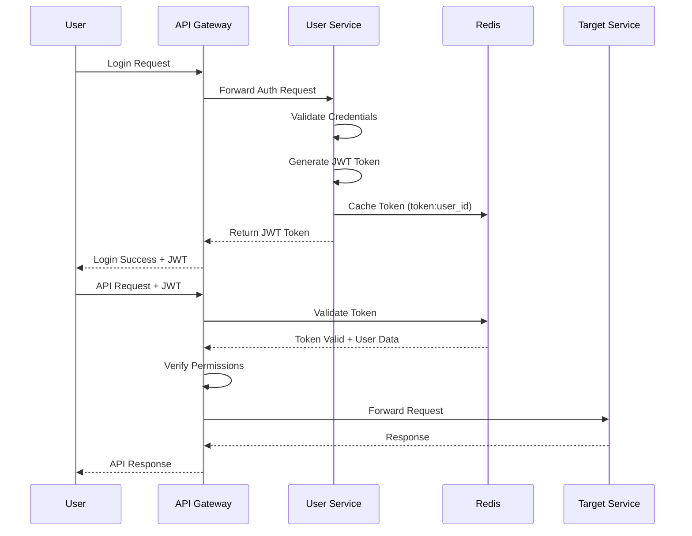

# Security Documentation

This directory contains comprehensive documentation of the security architecture and practices implemented in the Nibble platform. These documents explain how we protect user data, ensure system integrity, and maintain compliance with security standards.

## Security Architecture Overview

The Nibble platform employs a defense-in-depth approach with multiple security layers:

## 1. Authentication and Authorization

### Authentication

The system uses a JWT-based authentication system:

- **JSON Web Tokens (JWT)**: Used for stateless authentication
- **Token Expiration**: Short-lived access tokens with configurable expiration
- **Refresh Tokens**: Securely stored for obtaining new access tokens
- **Redis Token Caching**: For token validation and revocation
- **Password Security**: Passwords stored using bcrypt hashing algorithm

### Authorization

A role-based access control (RBAC) system restricts access to resources:

- **User Roles**: Customer, Restaurant Owner, Driver, Admin
- **Permission Checks**: At API Gateway and service levels
- **Resource Ownership**: Users can only access their own data
- **Service-Level Authorization**: Each service enforces its own authorization rules

## 2. Data Protection

### Data in Transit

- **TLS Encryption**: All HTTP communications use TLS 1.3+
- **Internal Service Communication**: Service-to-service communication is encrypted
- **Kafka Encryption**: Encrypted communication with Kafka

### Data at Rest

- **Sensitive Data Encryption**: Personal identifiable information (PII) encrypted in the database
- **Payment Information**: Payment data never stored directly; tokenized through payment processor
- **Encryption Keys**: Proper key management practices for encryption/decryption keys

### Data Minimization

- **Minimal Data Collection**: Only collecting necessary information
- **Data Retention Policies**: Clear policies for how long different types of data are kept
- **Data Anonymization**: Analytics data anonymized where possible

## 3. API Security

- **Input Validation**: All input validated using Pydantic models
- **Rate Limiting**: Preventing abuse through Redis-based rate limiting
- **CORS Configuration**: Appropriate Cross-Origin Resource Sharing settings
- **Content Security Policy**: Restrictions on content sources
- **HTTP Security Headers**: Implementation of security-related HTTP headers

## 4. Infrastructure Security

- **Container Security**: Secure Docker container configuration
- **Least Privilege Principle**: Services run with minimal required permissions
- **Network Segmentation**: Proper network isolation between services
- **Dependency Management**: Regular updates of dependencies to address vulnerabilities
- **Secret Management**: Secure handling of secrets and credentials

## Security by Component

### API Gateway Security

The API Gateway serves as the entry point and first line of defense:

- **Authentication Middleware**: Validating JWT tokens
- **Request Validation**: Basic validation of incoming requests
- **Rate Limiting**: Preventing brute force and DoS attacks
- **Request Logging**: Logging of all API requests for audit purposes
- **Response Filtering**: Preventing sensitive information leakage

### Database Security

Protection measures for database systems:

- **Connection Encryption**: Encrypted database connections
- **Schema Isolation**: Each service has access only to its schema
- **Parameterized Queries**: Prevention of SQL injection
- **Minimal Privilege**: Database users with minimal required permissions
- **Audit Logging**: Tracking of sensitive data access and modifications

### Kafka Security

Security controls for the event streaming platform:

- **Authentication**: Service authentication for Kafka access
- **Topic-Level Security**: Services only access relevant topics
- **Data Encryption**: Messages encrypted in transit
- **Secure Configuration**: Hardened Kafka broker configuration

## Security Processes

### Security Testing

- **Automated Security Scanning**: Regular automated security scans
- **Penetration Testing**: Periodic penetration testing
- **Dependency Scanning**: Checking for vulnerabilities in dependencies
- **Code Reviews**: Security-focused code reviews for sensitive functionality

### Incident Response

- **Security Monitoring**: Continuous monitoring for security events
- **Incident Response Plan**: Documented procedures for handling security incidents
- **Notification Process**: Process for notifying affected users when required

## Compliance Considerations

- **GDPR Compliance**: Meeting European data protection requirements
- **PCI DSS**: Payment Card Industry Data Security Standard considerations
- **Local Regulations**: Compliance with local data protection regulations

## Security Documentation

1. [Authentication System](./authentication.md)
2. [Data Encryption Implementation](./data-encryption.md)
3. [API Security Controls](./api-security.md)
4. [Infrastructure Security](./infrastructure-security.md)
5. [Security Testing Procedures](./security-testing.md)
6. [Incident Response Plan](./incident-response.md)

## Security Implementation Examples

### JWT Authentication Flow



### Personal Data Encryption

```python
# Example of how sensitive data is encrypted
def encrypt_personal_data(data: str, encryption_key: bytes) -> str:
    """Encrypt personal data using Fernet symmetric encryption"""
    f = Fernet(encryption_key)
    return f.encrypt(data.encode()).decode()

def decrypt_personal_data(encrypted_data: str, encryption_key: bytes) -> str:
    """Decrypt personal data using Fernet symmetric encryption"""
    f = Fernet(encryption_key)
    return f.decrypt(encrypted_data.encode()).decode()
```

## Security Best Practices for Developers

1. **Validate All Input**: Never trust user input; validate using Pydantic models
2. **Use Parameterized Queries**: Never build SQL queries using string concatenation
3. **Apply Least Privilege**: Services should only have access to required resources
4. **Implement Proper Error Handling**: Don't expose sensitive information in error messages
5. **Keep Dependencies Updated**: Regularly update to address security vulnerabilities
6. **Follow Authentication Guidelines**: Never bypass or weaken authentication mechanisms
7. **Secure API Endpoints**: Ensure proper authorization checks on all endpoints
8. **Protect Sensitive Data**: Never log sensitive information or store it unencrypted
9. **Use Secure Defaults**: Start with secure configurations and require explicit loosening
10. **Conduct Security Reviews**: Include security considerations in code reviews

## Further Reading

- [OWASP Top Ten](https://owasp.org/www-project-top-ten/)
- [JWT Best Practices](https://auth0.com/blog/a-look-at-the-latest-draft-for-jwt-bcp/)
- [Microservices Security Patterns](https://microservices.io/patterns/security/index.html)